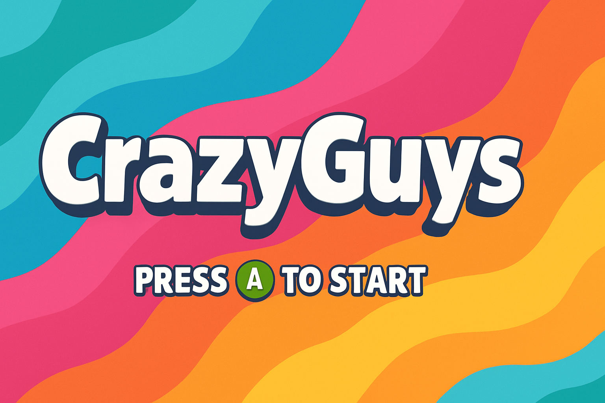
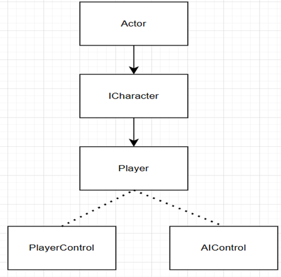
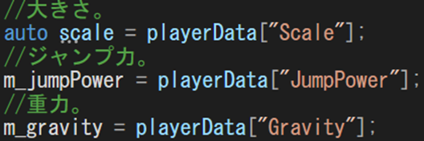
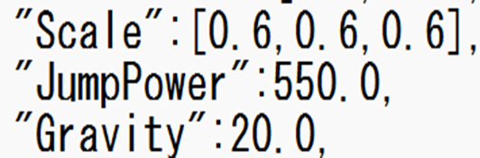

# CrazyGuyzポートフォリオ

---

## 河原電子ビジネス専門学校ゲームクリエイター科2年

## 氏名：酒井風駕

メールアドレス::CA01244012@st.kawahara.ac.jp



---

## 目次

- [CrazyGuyzポートフォリオ](#crazyguyzポートフォリオ)
  - [河原電子ビジネス専門学校ゲームクリエイター科2年](#河原電子ビジネス専門学校ゲームクリエイター科2年)
  - [氏名：酒井風駕](#氏名酒井風駕)
  - [目次](#目次)
- [作品概要](#作品概要)
- [開発環境・使用ツール](#開発環境使用ツール)
  - [3Dモデル](#3dモデル)
  - [画像制作](#画像制作)
  - [その他使用ツール](#その他使用ツール)
- [ゲーム内容](#ゲーム内容)
- [プレイ動画（PV）](#プレイ動画pv)
- [工夫点とアピールポイント](#工夫点とアピールポイント)
  - [1. 責務分離を意識したクラス設計](#1-責務分離を意識したクラス設計)
    - [クラス構成](#クラス構成)
  - [2. 外部ファイルを用いたパラメータ管理](#2-外部ファイルを用いたパラメータ管理)
    - [管理している主なパラメータ](#管理している主なパラメータ)
    - [C++ 側の実装例](#c-側の実装例)
    - [Json ファイル例](#json-ファイル例)
  - [3. Json によるステージオブジェクト生成（データドリブン設計）](#3-json-によるステージオブジェクト生成データドリブン設計)
    - [実装内容](#実装内容)
    - [Json 定義例](#json-定義例)
  - [フェード演出の設計と実装（FadeManager）](#フェード演出の設計と実装fademanager)
    - [シングルトンパターン採用の理由](#シングルトンパターン採用の理由)
    - [ラムダ式を用いたフェード完了後処理](#ラムダ式を用いたフェード完了後処理)
  - [5. サウンド管理の設計と実装（SoundManager）](#5-サウンド管理の設計と実装soundmanager)
    - [サウンド管理の設計方針](#サウンド管理の設計方針)
    - [BGM / SE の役割分離](#bgm--se-の役割分離)
      - [BGM](#bgm)
      - [SE](#se)
    - [Json によるサウンド定義の外部管理](#json-によるサウンド定義の外部管理)
      - [定義内容](#定義内容)
    - [呼び出し側の簡略化](#呼び出し側の簡略化)
  - [今後の展望](#今後の展望)
    - [オフスクリーンレンダリングを用いた画面分割対応](#オフスクリーンレンダリングを用いた画面分割対応)

---

# 作品概要

**タイトル**：CrazyGuys（クレイジーガイズ）
**ジャンル**：3Dパーティーアクションゲーム
**制作人数**：1人
**制作期間**：2025年8月 ～ 2026年1月
**プレイ人数**：1人 ～ 4人

**対応ハード**：PC（Windows 11）**対応デバイス**：

- キーボード
- Xbox 360 コントローラー（推奨）

**使用言語**：C++ / HLSL

---

# 開発環境・使用ツール

**エンジン**：学内制簡易エンジン（DirectX 12）
**開発環境**：Visual Studio 2022

## 3Dモデル

- Unity Asset Store
- 3ds Max
- Unity

## 画像制作

- Adobe Photoshop 2024
- ChatGPT

**エフェクト**：Effekseer
**サウンド**：AudioStock

**バージョン管理**：GitHub
**タスク管理**：Notion

## その他使用ツール

- Adobe Premiere Pro 2025
- ChatGPT
- GitHub Copilot

**GitHub URL**：

- https://github.com/sakaifuga0807/CrazyGuys

**実行ファイル**:
https://drive.google.com/file/d/1h6C84x7NnBCdfifx7zSAhRvhLPRT1LUk/view?usp=sharing

---

# ゲーム内容

『**CrazyGuys**』は、
**他のプレイヤーよりも早くゴールに到達することを目的とした、最大4人対戦の3Dアクションゲーム**です。

ステージ上には以下のようなギミックやトラップが配置されています。

- プレイヤーを弾き飛ばすギミック
- タイミングを見極めて進むトラップ

これらを乗り越えるためには、
**操作精度と状況判断**が重要になります。

---

# プレイ動画（PV）

<iframe
  width="800"
  height="450"
  src="https://youtu.be/7-fPs30Ndn4"
  allowfullscreen>
</iframe>

URL:
https://youtu.be/7-fPs30Ndn4

---

# 工夫点とアピールポイント

## 1. 責務分離を意識したクラス設計

プレイヤーキャラクターの実装において、「状態管理・挙動管理」と「入力処理」を分離して設計しました。

### クラス構成

- **Player**
  - 状態遷移管理
  - アニメーション制御
  - 当たり判定処理
- **PlayerControl**
  - プレイヤー入力処理
- **AIControl**
  - AI操作時の入力処理

入力処理を Player から切り離すことで、人操作と AI 操作を同一インターフェースで切り替え可能な構成を実現しています。
これにより、将来的な **画面分割によるマルチプレイ対応や AI 切り替え**にも拡張しやすい設計となっています。



---

## 2. 外部ファイルを用いたパラメータ管理

ゲーム内で使用する各種設定値は **Json ファイルを用いて外部管理**しています。

### 管理している主なパラメータ

- プレイヤーの移動速度
- ジャンプ力
- 各種ゲームバランス関連数値

数値を外部ファイルで管理することで、**コードを修正せずにゲームバランスの調整が可能**となり、試行錯誤を効率的に行えるようになりました。
また、マジックナンバーの発生を防ぎ、可読性・保守性の向上にも繋がっています。

### C++ 側の実装例



### Json ファイル例



---

## 3. Json によるステージオブジェクト生成（データドリブン設計）

本作品では、ステージ上に配置される **全てのギミック・オブジェクトを Json ファイルから生成**する仕組みを実装しています。

ハンマー、シーソー、斧、回転床などのギミックは、コードに直接配置情報や数値を記述せず、
**外部 Json ファイルを用いたデータドリブン設計**で管理しています。

これにより、

- ステージ調整の柔軟性向上
- 実装とデータ定義の分離
- ステージ追加・調整コストの削減
  を実現しています。

### 実装内容

各ギミックごとに設定用 Json ファイルを用意し、以下の情報を定義しています。

- 位置（Position）
- 回転（Rotation）
- 大きさ（Scale）
- ギミック固有のパラメータ（速度・可動範囲など）

### Json 定義例

```json
{
  "Position": [0.0, 200.0, -500.0],
  "Rotation": [0.0, 0.0, 0.0, 1.0],
  "Scale": [1.0, 1.0, 1.0],
  "Speed": 2.0,
  "Range": 45.0
}
```

---

## フェード演出の設計と実装（FadeManager）

本作では画面遷移時の視覚的な違和感を抑えるため、フェード演出を以下のタイミングで使用しています。

- タイトル → インゲーム遷移
- プレイヤーのリスポーン時
- リザルト画面への遷移

これらを **FadeManager として一元管理** し、
シングルトンパターンで実装しました。

### シングルトンパターン採用の理由

フェード処理は
「どのシーン・どのオブジェクトからでも呼ばれる可能性がある」
という性質を持っています。

そのため、

- インスタンスの重複生成を防ぐ
- フェード状態を全体で共有する
- 呼び出し側が生成を意識しなくてよい

といった点を重視し、
`FadeManager` をシングルトンとして実装しました。

### ラムダ式を用いたフェード完了後処理

フェード終了後に実行する処理は、
**ラムダ式として外部から渡せる設計** にしています。

```cpp
FadeManager::GetInstance()->FadeOut(1.0f,[this]()
    {
        ChangeState(enState_InGame);
    }
);
```

---

## 5. サウンド管理の設計と実装（SoundManager）

本作では、ゲーム内で使用する **BGM・SE を SoundManager クラスで一元管理**しています。

従来のように、各クラスが直接サウンドの読み込み・再生を行う方式では、

- 再生処理が各所に分散しやすい
- シーン遷移時に音が残るなどの不具合が起きやすい
- サウンドの追加・調整コストが高い

といった問題がありました。

これらを解決するため、
**SoundManager による集中管理方式**を採用しています。

### サウンド管理の設計方針

- サウンド制御の責務を 1 クラスに集約
- BGM と SE を明確に役割分離
- 呼び出し側は「音を鳴らす意図」のみ記述する

### BGM / SE の役割分離

SoundManager では、BGM と SE を以下のように扱っています。

#### BGM

- 常に **1 種類のみ再生**
- 新しい BGM 再生時に既存 BGM を停止・破棄
- シーン遷移を跨いだ安全な管理が可能

#### SE

- **複数同時再生に対応**
- 再生ごとに SoundSource を生成
- ゲーム中の細かな演出に対応可能

この設計により、
**BGM の多重再生防止**と**SE の柔軟な演出**を両立しています。

### Json によるサウンド定義の外部管理

使用するサウンドは Json ファイルで定義し、
ゲーム起動時に一括で読み込んでいます。

#### 定義内容

- サウンド ID
- サウンド名
- ファイルパス
- 音量
- ループ有無（BGM / SE 判定）

この仕組みにより、

- サウンドの追加・差し替えが容易
- 音量調整をコード修正なしで対応可能
- マジックナンバーを排除し、可読性を向上

といったメリットを得ています。

### 呼び出し側の簡略化

従来は、各クラスで以下のような処理を直接記述していました。

- Wave ファイル登録
- SoundSource の生成
- 再生設定

SoundManager 導入後は、
以下のように **名前指定のみで再生可能**になっています。

```cpp
SoundManager::Get().Play("GameStart");
```

---

## 今後の展望

### オフスクリーンレンダリングを用いた画面分割対応

本作では、最大4人までのマルチプレイを想定した設計を行っていますが、
今後の拡張として **オフスクリーンレンダリングを用いた画面分割描画** に取り組みたいと考えています。

画面分割マルチプレイでは、
プレイヤーごとに異なるカメラ視点を持つ必要があり、
通常の描画手法では描画管理が複雑になりがちです。

そこで、各プレイヤーの視点を

- それぞれ **オフスクリーンレンダリング（レンダーターゲット）** に描画
- 描画結果を **1枚の画面用ポリゴンに貼り付け、UV を分割して表示**

という構成を採用することで、

- 画面分割ロジックの単純化
- 描画処理と表示処理の分離
- 分割数（2～4人）に応じた柔軟なレイアウト変更

を実現できると考えています。
